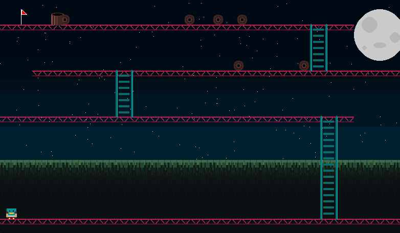

# Gráficos 2D y 3D 📖

## Parcial 1

### Descripción:

En este parcial, comenzamos con prácticas básicas para reforzar conceptos fundamentales de programación en Java, como el paso de parámetros por valor o referencia y el manejo de objetos. Posteriormente, nos adentramos en el uso de la librería Java Graphics para la creación de interfaces gráficas.

- **Prácticas básicas:**
  - Trabajo con `JFrame` y tipos de datos en Java
- **Java Graphics:**
  - Uso de la librería Java Graphics y sus métodos
  - Implementación de eventos gráficos con Java Graphics

## Proyecto 1. Reloj de Manecillas 🚀

### Descripción:

El doble buffering es una técnica esencial en animaciones por computadora. Por defecto, la computadora tiende a borrar la imagen del frame anterior antes de imprimir la nueva, lo que puede causar un parpadeo perceptible cada vez que se actualiza la imagen.

Para evitar esto, se utiliza el doble buffering. Esta técnica consiste en almacenar las imágenes en un buffer (memoria RAM), permitiendo "volcar" la nueva imagen en cada actualización y superponerla sobre la anterior. De esta manera, solo necesitamos generar las partes de la imagen que han cambiado, reduciendo significativamente el parpadeo.

**Características del proyecto:**

- **Reloj análogo:** Se actualiza cada 10ms para un movimiento suave de las manecillas.
- **Imagen de fondo:** Almacenada en memoria RAM para facilitar actualizaciones rápidas.
- **Técnica de doble buffer:** Implementada para evitar parpadeos en la imagen al actualizar las manecillas.
- **Java Graphics:** Uso de gráficos en Java y manipulación de líneas según su ángulo.
- **Hilo principal de ejecución:** Responsable de actualizar la imagen continuamente.

<p align="center"> 
    
</p>

## Parcial 2

### Descripción:

En este parcial, implementamos nuestra propia librería gráfica 2D. Comenzamos con la impresión de un píxel en un `JFrame` y expandimos las funcionalidades para incluir diversos algoritmos gráficos.

- **Impresión de un píxel:**
  ```java
  public void putPixel(int x, int y, Color c) {
      buffer.setRGB(x, y, c.getRGB());
      this.getGraphics().drawImage(buffer, 0, 0, this);
  }
  ```
- **Líneas:**
  - Algoritmo DDA
  - Bresenham
  - Punto Medio
  - Método de pendiente
- **Circunferencias:**
  - Simetría de ocho lados
  - Bresenham
  - Punto Medio
  - Elipse
- **Recortes:**
  - En circunferencias
  - Por códigos
  - Explícito
- **Grosor de lineas:**
  - Líneas rectas
  - Circunferencias
- **Máscaras:**
  - Líneas rectas punteadas
  - Circunferencias punteadas
- **Rellenos:**
  - Inundación
  - ScanLine

<p align="center">
    
    
    
    
    
</p>

## Proyecto 2. Juego de Donkey Kong 🚀

### Descripción:

En este proyecto, utilizamos métodos gráficos desarrollados por nosotros y aplicamos la técnica de doble buffer para lograr una animación suave y sin parpadeos.

**Características del proyecto:**

- **Uso de métodos gráficos:**
  - Implementación de todos los métodos gráficos mencionados en el parcial 2: líneas, circunferencias, recortes, grosor de líneas, máscaras y rellenos.
- **Movimiento del personaje:**
  - Implementación de salto, gravedad y escalado de escaleras para el personaje principal.
- **Actualización eficiente:**
  - Actualización solo en la posición del personaje y los barriles (móviles durante la animación) para mejorar el rendimiento.
- **Implementación de doble buffer:**
  - Utilización de doble buffer (uno para el escenario y otro para los objetos móviles) y un hilo principal de ejecución para garantizar una animación sin parpadeos.
- **Detalles visuales:**
  - Fondo con relleno realizado con scanline y máscaras para agregar detalles.
  - Escaleras y vigas realizadas con máscaras y líneas de algoritmo Bresenham respectivamente.
  - Relleno de la luna utilizando el algoritmo de relleno floodfill.

<p align="center"> 
    
</p>

## Parcial 3

### Descripción:

En este parcial, exploramos la impresión de objetos 3D en pantalla, empleando diversas técnicas para convertir coordenadas 3D a 2D y mostrar las figuras de manera precisa.

**Características del proyecto:**

- **Cubo:**
  - Dibujo de un cubo desde una coordenada central.
  - Representación de un cubo con un punto de fuga y reducción de tamaño conforme a la coordenada z.
- **Traslación de Cubo:**
  - Movimiento de la posición de la coordenada principal en un cubo mediante KeyListener y un hilo de ejecución.
- **Escalamiento de Cubo:**
  - Aumento de tamaño de un cubo mediante KeyListener y un hilo de ejecución.
- **Rotación de Cubo:**
  - Rotación de las aristas del cubo mediante KeyListener y un hilo de ejecución.
- **Curvas:**
  - Dibujo de una curva explícita (mediante una función) y definición de la cantidad de puntos de la curva (cuantos más puntos, mayor detalle de la curva).
  - Implementación de métodos de traslación, escalamiento y rotación.
- **Superficie:**
  - Dibujo de una superficie explícita (reutilizando el método de curvas previamente creado).
  - Mallado rectangular.
  - Implementación de métodos de traslación, escalamiento y rotación.
- **Superficie esfera:**
  - Dibujo de una superficie esférica explícita (reutilizando el método de curvas previamente creado).
  - Mallado mixto triangular y rectangular.
  - Implementación de métodos de traslación, escalamiento y rotación.
- **Cilindro (Reloj de Arena):**
  - Dibujo de una superficie cilíndrica explícita (reutilizando el método de curvas previamente creado).
  - Color de píxeles según la coordenada z del píxel.
  - Implementación de métodos de traslación, escalamiento y rotación.

<p align="center">
    
    
    
    
    
    
</p>
